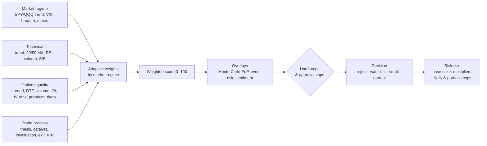
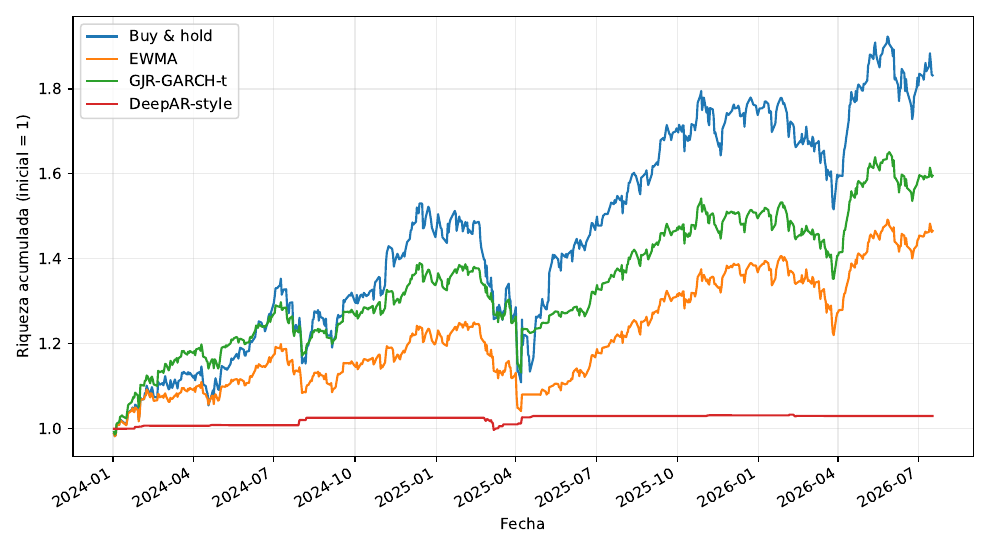

# RiskGate

**A pre-trade risk gate for retail options trading.** Every trade idea has to pass a transparent, rule-based scoring engine before capital goes in. The engine scores market regime, technicals, option-contract quality and the quality of the trade plan, applies hard stops, and sizes the position under portfolio-level caps.

*Two ideas run through `evaluateTradeIdea()` ([`scripts/export-model-figures.ts`](scripts/export-model-figures.ts)). A chasing, 5-DTE, wide-spread TSLA call is rejected by five hard stops. A documented, liquid AAPL debit spread passes, but the Monte Carlo overlay and confidence multiplier shrink its size to 125 MXN, below its 260 max loss, so the app also warns.*

> Local-first Next.js app + Python research harness · built by **Hector Campbell** with **Santiago Mejía Torres** ([@codemexico](https://github.com/codemexico)) · decision-support tool, **not financial advice**.

## Why

Small options accounts rarely blow up because of one bad forecast. They blow up from process failures: no written thesis, no invalidation level, illiquid contracts, oversizing, theta bleeding out a position. RiskGate's goal is **risk governance, not alpha**. It forces a plan, penalizes bad execution conditions, and caps what one idea can cost.

## How the engine works



**1. Four sub-scores (0–100).** Market regime and technicals are rule-based. Options quality is **continuous**: seven smooth quality functions, weighted spread 30 %, DTE 20 %, volume 15 %, open interest 15 %, IV rank 8 %, premium size 7 %, theta 5 %.

**2. Adaptive weights.** In stressed/bearish regimes options quality weighs 35 % (execution matters most). In a bullish regime technicals get 30 %. Neutral: market 35 / technical 25 / options 25 / process 15.

**3. Overlays.** A 5,000-path Monte Carlo on the actual option legs (multi-leg aware) estimates probability of profit, EV, P5 and CVaR95 and adjusts the score. Event risk (earnings, FOMC, CPI…) and an optional news-sentiment overlay can cap the decision.

**4. Hard stops.** No approval without a written thesis, an invalidation level, a positive max loss and an exit plan. Also no approval with spread > 15 %, DTE < 7, premium > 1 % of the portfolio, or both volume < 25 and OI < 100. Chasing, IV rank > 80, or extreme theta/gamma cap the decision at *watchlist*.

**5. Position sizing.**

```math
\text{risk} = \text{base risk} \times m_{\text{confidence}} \times m_{\text{liquidity}} \times m_{\text{regime}} \times m_{\text{volatility}} \times m_{\text{concentration}} \times m_{\text{MC}} \times m_{\text{sentiment}} \times m_{\text{event}}
```

The result is then capped by a quarter-Kelly limit (from the estimated PoP and payoff ratio), the options-sleeve budget, the monthly loss limit and the open-risk limit.

## The app

| Screen | What it does |
|---|---|
| Portfolio | Multi-account positions, cash, P&L, allocation; imports broker (GBM) Excel statements |
| Watchlist / Discover | Quote refresh, automatic candidate discovery with per-symbol history and cool-downs |
| Options chain | Alpaca option snapshots; contract selector scores every contract (delta fit, liquidity, DTE…) |
| Trade ideas | Idea form → full score breakdown, reasons, warnings, suggested size |
| Journal | Entries/exits, score-band backtest, bootstrap of journal outcomes |
| Model guide / Risk model | The scoring and sizing rules, explained inside the app |

A daily scan (`npm run scan:daily`) refreshes portfolios, rebuilds the regime, discovers candidates, picks contracts and scores them. Every run is logged.

## Research

**`experiments/exit-forecasting/`**: does a volatility or ML forecast improve *exits* on long positions? Ten large-cap US tickers, train ≤ 2021, validation 2022–23, out-of-sample test 2024 onward, 5 bps costs:

| Exit overlay | Annual return | Sharpe | Max drawdown | Time invested |
|---|---|---|---|---|
| Buy & hold | 27.1 % | 1.16 | −27.5 % | 100 % |
| EWMA volatility filter | 16.3 % | 1.13 | −16.8 % | 77 % |
| **GJR-GARCH(1,1)-t filter** | 20.3 % | **1.31** | **−18.5 %** | 77 % |
| DeepAR-style LSTM | 1.2 % | 0.64 | −2.8 % | 0.5 % |



The GARCH filter gave the best risk-adjusted result. A second, stricter experiment (test from 2020, per-asset normalization, gradual exits, a quantile LightGBM benchmark) showed the GARCH advantage was **not robust**: the bootstrap 90 % CI of the Sharpe difference vs. buy & hold spans zero, and LightGBM was consistently worse. So none of these rules was added to RiskGate's live score. Full write-ups (Spanish) are in the experiment folder.

**`options-strategy-bot/`** is a standalone Python harness. It scans a universe, scores setups with a RiskGate-style model, backtests rules, simulates defined-risk structures with Black–Scholes proxies, and keeps a paper ledger. An Alpaca execution adapter runs in dry-run mode by default and only sends orders with an explicit `--live` flag.

## Honest limitations

- The engine is rule-based and explainable, but **it is not proven to have positive expected value**. Proving edge needs a larger sample of journaled trades or a high-fidelity historical option-chain replay.
- On a small account the premium and Kelly caps are strict enough to reject most mechanical historical candidates. That is by design, but it limits backtesting.
- Market data comes from free sources (Yahoo, Alpaca paper/indicative feed).

## Tech

Next.js (App Router) · React · TypeScript · Tailwind · Prisma + SQLite · Recharts · Zod · Alpaca Market Data API · Python (pandas, arch, PyTorch, LightGBM) for research · 25 unit tests (`node:test` via tsx)

```
app/                    Next.js screens + server actions
lib/risk.ts             evaluateTradeIdea(): scoring, hard stops, sizing
lib/risk/               market regime, options quality, event risk, strategy checks
lib/options/            multi-leg metrics, Monte Carlo, probability of profit + Kelly
lib/option-selector.ts  contract ranking from live option chains
prisma/                 schema + demo seed (fictional positions and ideas)
scripts/                daily scan, migrations, figure export
tests/                  unit tests for the model
experiments/            exit-forecasting study (Python + LaTeX reports)
options-strategy-bot/   standalone Python research/backtest bot
docs/                   model documentation (PDF/LaTeX, Spanish) and README figures
```

## Run locally

```bash
npm install
cp .env.example .env          # Alpaca paper keys are optional
npm run prisma:generate
npm run db:init
npm run seed                  # demo portfolio, watchlist and two sample ideas
npm run dev                   # http://127.0.0.1:3000
npm test                      # 25 model tests
```

No broker credentials are ever stored. Positions are entered manually or imported from statements.
